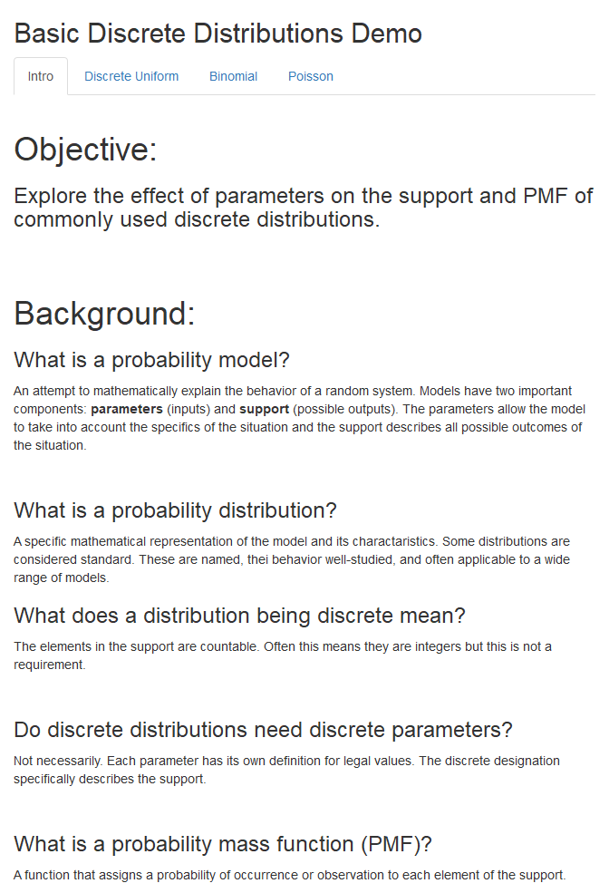
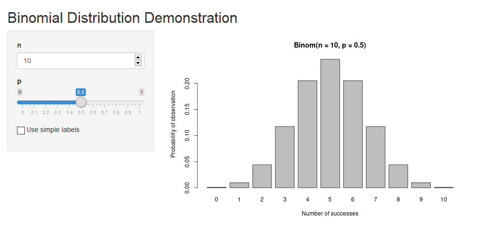

# Learning Shiny

I am on an adventure to learn to code Shiny apps (applications based in
R functionality and syntax) to be used as stats learning aids!

# Upcomming

-   Continuous distribution app using dynamic distribution
    charactaristics
-   `q*()`, `p*()`, `d*()` demonstration

# Progress

## User controlled simulation: Central Limit Theorem Demonstration for Means

> **short name**: cltdemo  
> **URL**:
> [ganovak.shinyapps.io/cltdemo](https://ganovak.shinyapps.io/cltdemo/)  
> **Objective**: Visually demonstrate the implications of the central
> limit theorem for means by allowing user control of various
> parameters  
> **Input**:  
> Population distribution: one of uniform, normal, or skewed
> (chi-squared) with randomized parameters  
> n: integer in (0, ∞)  
> **Output**:  
> Plot of population distribution and numerical summaries along with
> user controlled, gradual CLT simulation with reactive plot of
> appropriate numerical summaries

### New features

-   Dynamic disabling of UI elements
-   Custom layout
-   Differentiating use of eventReact and eventObserve
-   Using reactive values
-   Updating objects throught program
-   Delayed response

## An extension with increased complexity: Basic Discrete Distribution Demo

> **short name**: basicdisretedemo  
> **URL**:
> [ganovak.shinyapps.io/basicdiscretedemo](https://ganovak.shinyapps.io/basicdiscretedemo/)  
> **Objective**: Visually demonstrate effect of parameters on support
> and PMF of commonly used discrete distributions  
> **Input**:  
> Discrete Uniform:  
> A, B: integer in \[0, 100\] NOTE: bounds are arbitrary  
> Binomial:  
> n: integer in \[0,100\] NOTE: upper bound is arbitrary  
> p: real in \[0,1\]  
> Poisson:  
> λ: real in (0, ∞)  
> **Output**: Bar plot of PMF of specified distribution with user
> specified parameters

### New features

-   Tabbed Layout
-   Use of Unicode characters
-   Addition of discrete uniform and Poisson distributions
-   Addition of text elements

<!-- -->

## My first app: Binomial Distribution Demo

> **short name**: binomdemo  
> **URL**:
> [ganovak.shinyapps.io/binomdemo](https://ganovak.shinyapps.io/binomdemo/)  
> **Function**: Visually demonstrate effect of parameters in binomial
> distribution  
> **Input**:  
> n: integer in \[0,100\] NOTE: upper bound is arbitrary  
> p: real in \[0,1\]  
> **Output**: Bar plot of PMF of binomial distribution with user
> specified parameters

