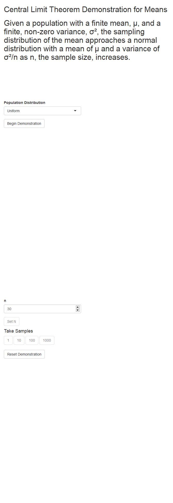

# Learning Shiny

I am on an adventure to learn to code Shiny apps (applications based in
R functionality and syntax) to be used as stats learing aids!

## My first app: binomdemo

> **Binomial Distribution Demonstration App**
>
> **short name**: binomdemo  
> **URL**: <https://ganovak.shinyapps.io/binomdemo/>  
> **Function**: Visually demonstrate effect of parameters in binomial
> distribution  
> **Input**:  
> n: integer in \[0,100\] NOTE: upper bound is arbitrary  
> p: real in \[0,1\]  
> **Output**: Barplot of PMF of binomial distribution with user
> specified parameters

<!-- -->
